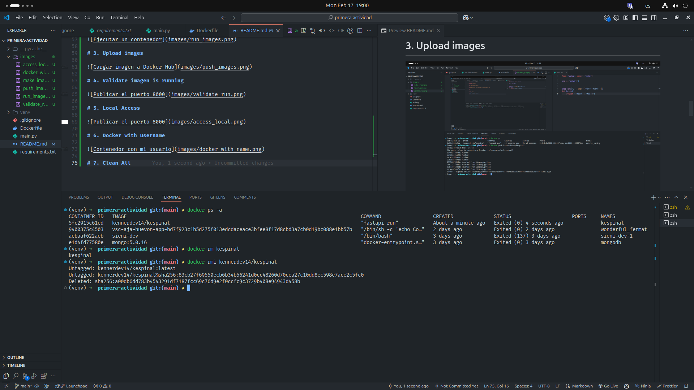

# FastAPI APP


## Validations
The first one is validate that python is installed on your PC

```
python3 --version
```

So should validate that you manager of virtual env

```
sudo apt install python3.12-env
```

## Run server

### Run in local Mode

1. Crear virtual env
```
python3 -m venv venv
```

2. Activate virtual env
#### Windows
```
venv\Scripts\Activate.ps1
```
#### Windows
```
venv\Scripts\activate
```

#### Linux - Mac
```
source venv/bin/activate
```

3. Dependecies installation
```
pip install -r requirements.txt
```


4. Run server in local mode
```
fastapi dev main.py
```

### Run in Docker mode

1. Build docker image
```
docker build -t nombre_imagen . 
```

2. Run images
```
docker run -p 8000:8000 nombre_imagen 
```

### Download from Docker Hub
1. Pull images
```
docker pull kennerdev14/kespinal
```

2. Run imagen
```
docker run -p 8000:8000 -d kennerdev14/kespnal
```

# IMAGES

# 1. Build Image


# 2. Run Image


# 3. Upload images


# 4. Validate imagen is running


# 5. Local Access 


# 6. Docker with username


# 7. Clean All 



# 8. Image uploaded on Docker Hub


